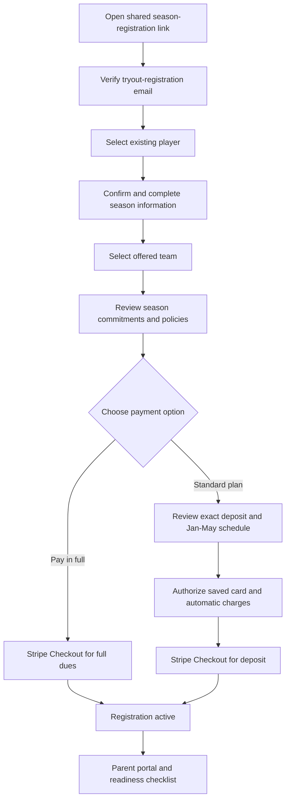

# Club Season Registration and Payment System

**Status:** Product requirements and implementation reference
**Last updated:** August 6, 2026
**Applies to:** TVVC club-season team acceptance and dues collection
**Related systems:** Tryout registration, parent portal, Stripe, Turso, Resend, Netlify

## 1. Purpose

This document records the agreed requirements, recommended features, operating rules, and implementation direction for the TVVC club-season registration and payment system.

The system begins after a player has attended TVVC tryouts and received an offer to join a team. It must allow a family to:

1. Open one shared season-registration link supplied by TVVC.
2. Locate and confirm the player's existing tryout information.
3. Provide any additional season information.
4. Identify the team the player was offered.
5. Accept the team spot and required agreements.
6. Pay in full or authorize the standard automatic payment plan.
7. View and manage the account through the parent portal.

It must also give TVVC administrators flexible tools for team setup, payment-plan exceptions, failed-payment recovery, credits, refunds, offline payments, and player-readiness tracking.

## 2. Confirmed Business Decisions

The following decisions are confirmed unless this document is deliberately revised.

| Area | Confirmed decision |
| --- | --- |
| Registration access | TVVC will send one standard season-registration link to families that receive offers. |
| Public visibility | The link will not appear in public site navigation or the sitemap and the page will be marked `noindex`. |
| Family verification | A family will verify the email address used for tryout registration before existing player information is disclosed. |
| Player source | Every offered player will already have completed the TVVC tryout-registration process. |
| Team assignment | An administrator assigns the offered team when creating the offer; the parent reviews and confirms that assignment. This avoids accidental selection of the wrong team. |
| Team availability | Actual teams will be created by an administrator after tryouts, when the number of teams at each age group is known. |
| Pricing tiers | There are two standard pricing structures: 12U and 13U-18U. |
| Payment choices | Pay in full or pay a deposit and authorize the standard automatic payment plan. |
| Alternative plans | Families needing another arrangement will contact TVVC. An administrator can create a customized plan in the system. |
| Default billing day | The fifth day of the month. |
| December | No standard installment is charged in December. |
| Standard installments | Five automatic installments on January 5, February 5, March 5, April 5, and May 5. |
| Card storage | Stripe stores payment methods. TVVC does not store complete card details. |
| Failed payments | A failed payment does not automatically remove a player from a team or cancel the registration. |
| Plan revisions | Paid installments remain immutable. Future unpaid installments may be replaced by a parent-approved revised plan. |
| Voluntary withdrawal after practices begin | Refunds and remaining balances will be reviewed case by case rather than controlled by one automatic outcome. |
| Time zone | Scheduling and displayed dates use `America/Los_Angeles`. |

## 3. Standard Pricing and Payment Dates

### 3.1 13U-18U standard plan

| Charge | Due date | Amount |
| --- | --- | ---: |
| Deposit | Immediately when season registration is completed, normally in November | $400 |
| Installment 1 | January 5 | $220 |
| Installment 2 | February 5 | $220 |
| Installment 3 | March 5 | $220 |
| Installment 4 | April 5 | $220 |
| Installment 5 | May 5 | $220 |
| **Total** |  | **$1,500** |

The pay-in-full option charges $1,500 when registration is completed.

### 3.2 12U standard plan

| Charge | Due date | Amount |
| --- | --- | ---: |
| Deposit | Immediately when season registration is completed, normally in November | $300 |
| Installment 1 | January 5 | $180 |
| Installment 2 | February 5 | $180 |
| Installment 3 | March 5 | $180 |
| Installment 4 | April 5 | $180 |
| Installment 5 | May 5 | $180 |
| **Total** |  | **$1,200** |

The pay-in-full option charges $1,200 when registration is completed.

### 3.3 Pricing assignment

Pricing must be assigned through explicit configuration, not inferred from a team name.

- A season contains age groups.
- Each age group is assigned a pricing tier.
- Each team is assigned an age group.
- A team therefore inherits the correct pricing tier.
- An administrator may override pricing for an individual registration without changing the team default.

Examples:

- `12 Teal` -> age group `12U` -> 12U pricing
- `13 Black` -> age group `13U` -> 13U-18U pricing
- `16 Teal` -> age group `16U` -> 13U-18U pricing

Teams can be added, renamed, activated, or deactivated after tryouts without a code change. Only active teams appear to parents.

## 4. Shared-Link Access and Player Lookup

The shared URL should be stable, such as `/season-registration`. The exact route can be finalized during implementation.

An unlisted URL is not sufficient security by itself. The page may be shared or forwarded, so the system must protect player data with verification and server-side authorization.

Implemented access flow:

1. Parent opens the shared `/season-registration` URL.
2. Parent signs in through the existing Resend magic-link flow using the email from tryout registration.
3. The server verifies the current account and resolves offers through the paid tryout registration and immutable athlete snapshot—not email text alone.
4. The parent sees only offers belonging to that verified primary account.
5. The parent reviews the player, assigned team, pricing, response deadline, and payment choices.
6. The parent starts a registration draft or declines the offer. Starting a draft does not finalize the roster spot; acceptance remains contingent on the later successful deposit.

Security requirements:

- Do not reveal whether an email or player exists before verification.
- Rate-limit lookup and verification attempts.
- Use short-lived, single-use verification tokens stored as hashes.
- Prevent duplicate completed season registrations for the same player and season.
- Require server-side ownership checks for every parent-portal and payment action.
- Mark the route `noindex` and omit it from public navigation and sitemap generation.

### 4.1 Milestone 2A implementation status — August 6, 2026

Implemented on the dark feature branch:

- Offer and registration-draft database tables with one offer per player and season
- Admin bulk-offer workspace designed for the full tryout roster
- Active-team assignment, optional response deadline, search, filtering, batch selection, retry-safe creation, revocation, and restoration
- Shared parent route with signed-out, no-offer, offered, expired, revoked, declined, draft-started, and accepted presentations
- Verified ownership checks tied to both the paid registration and athlete snapshot
- Generic signed-out/no-offer states that do not disclose another family's data
- Feature flag, season-level enable switch, `noindex`, and sitemap exclusion
- Parent actions to start a draft or decline; final acceptance and payment are deliberately deferred
- Automated migration, callback security, bulk idempotency, email-collision, cross-family, and same-origin tests

Not yet implemented in this milestone:

- The additional season-information form and draft autosave
- Agreement/refund-policy acceptance snapshots
- Stripe deposit checkout, pay-in-full, or automatic installment authorization
- Offer, reminder, payment-confirmation, or failure emails
- Custom payment plans and later plan revisions

### 4.2 Milestone 2B implementation status — August 6, 2026

Implemented on the dark feature branch:

- Three-step save-and-resume registration draft for family/contact, player/readiness, and agreement review
- Mailing address, emergency contact, communication preference, uniform sizing, jersey-number preferences, medical confirmation, CEVA status, medical-release status, and known season conflicts
- Server-prefilled draft values from the immutable tryout snapshot without changing the original registration or player profile
- Serialized autosave with a version counter; concurrent stale-tab writes are rejected instead of silently overwriting newer information
- Bounded server-side validation and a separate completeness check before agreement submission
- Versioned agreement records supporting acknowledgements and explicit choices
- Immutable acceptance evidence containing the exact agreement text, content hash, response, verified parent identity/email, timestamp, user agent, privacy-preserving request-IP hash when available, and season/team/pricing context
- Database triggers preventing published agreement text and recorded acceptance evidence from being rewritten or deleted
- A completed-information `awaiting_payment` state that does not mark the offer accepted or the player confirmed
- Concurrency protection for simultaneous start/decline actions

Production agreement wording is deliberately **not seeded or published** by the migration. The current refund policy remains a working draft pending TVVC/board/legal approval. Until approved versions are published, families can safely save registration information but cannot record agreements or continue to payment. Automated browser fixtures use clearly isolated test-only agreement versions.

Still deferred to the payment milestone:

- Payment-option selection
- Exact payment schedule snapshot
- Automatic-payment authorization
- Stripe Checkout and deposit collection
- Final offer/roster acceptance after successful payment

## 5. Information Already Collected at Tryouts

The existing tryout flow already collects or supports:

- Primary parent name, email, and phone
- Secondary parent name, email, and phone
- Emergency phone
- Player first, last, and preferred names
- Date of birth
- Gender division
- Grade
- School
- Graduation year
- Volleyball experience
- Positions
- Medical information
- Liability waiver acceptance

The season form should prefill these fields and ask the parent to confirm or update them rather than re-enter everything.

## 6. Recommended Additional Season Information

Milestone 2B uses the following initial field set. It remains configurable before launch:

- Offered team
- Mailing address
- Jersey size
- Apparel size
- Jersey-number preferences
- Updated emergency and medical information
- CEVA/USA Volleyball membership status or membership number
- Medical-release completion status
- Media-release choice
- Parent and player code of conduct
- Travel and tournament commitment acknowledgement
- Financial agreement and refund policy
- Communication preferences

Do not collect sensitive information merely because it might be useful someday. In particular, avoid collecting Social Security numbers, full insurance records, complete medical histories, or complete payment-card information.

## 7. Parent Registration Flow

### 7.1 Suggested form steps

1. **Verify family**
2. **Select player**
3. **Confirm family and player information**
4. **Season details and offered team**
5. **Uniform and medical updates**
6. **Commitments, conduct, and releases**
7. **Payment choice and financial agreement**
8. **Final review and Stripe payment**

The form should support save-and-resume. It should remain usable on mobile devices and should not require a family to repeat data after a refresh or temporary interruption.

### 7.2 Team selection safeguards

- Show only teams active for the current season.
- Require the parent to confirm that the selected team is the team offered by TVVC.
- Compare the selected age group with date of birth and graduation year.
- Flag unusual combinations for admin review rather than automatically blocking legitimate age waivers or club-approved placements.
- Read all prices from the server. Never accept a price calculated or submitted only by the browser.

### 7.3 Accept and decline

The system should support an explicit decline path, including an optional reason. This allows TVVC to distinguish declined offers from families who have not responded.

An administrator should be able to configure an acceptance deadline and extend it for an individual family.

## 8. Automatic-Payment Authorization

Parents selecting a payment plan must explicitly authorize off-session automatic card charges. Before Stripe Checkout, the page must show:

- Total season dues
- Deposit charged immediately
- Every future installment amount
- Every future charge date
- The failed-payment process
- The cancellation and refund policy
- How to update the payment method
- Any processing fees, if applicable

Suggested authorization concept:

> I authorize Tualatin Valley Volleyball Club to charge the payment method provided today for the deposit and the scheduled installments shown above. I understand that Stripe will securely store the payment method and that TVVC will initiate the listed charges automatically on the specified dates.

The parent must actively check the authorization box. The system must retain:

- Agreement text or immutable agreement version
- Exact accepted schedule
- Parent identity and verified email
- Acceptance timestamp
- Request IP address and user agent where appropriate
- Stripe customer and payment-method references

Parents paying in full do not authorize future automatic installments. Customized plans require the same explicit authorization with the individualized dates and amounts displayed.

Stripe guidance requires explicit consent for saved payment methods used off-session and disclosure of anticipated timing, frequency, and how amounts are determined:

- <https://docs.stripe.com/payments/off-session-payments>
- <https://docs.stripe.com/payments/checkout/save-during-payment>

## 9. Payment Lifecycle

Registration status and financial status must remain separate.

### 9.1 Suggested registration statuses

- `draft`
- `awaiting_payment`
- `active`
- `declined`
- `cancelled`
- `completed`

### 9.2 Suggested financial statuses

- `not_started`
- `current`
- `past_due`
- `action_required`
- `paid_in_full`
- `paused`
- `cancelled`
- `written_off`

A failed installment changes the financial status but does not automatically change the team assignment or active registration status.

### 9.3 Source of truth

- TVVC owns the registration, plan configuration, installment ledger, agreements, readiness checklist, and business statuses.
- Stripe owns payment-method data, payment attempts, invoices, receipts, and processor results.
- Stripe webhooks update TVVC records.
- Webhook processing must be idempotent so duplicate deliveries cannot duplicate a payment or status transition.

## 10. Failed-Payment Recovery

Recommended workflow:

1. Stripe attempts the charge on the scheduled date.
2. If the attempt succeeds, the installment becomes `paid` and the balance is updated.
3. If it fails, the installment becomes `past_due` and the account is flagged.
4. Parent receives an immediate recovery email with a secure payment-method or authentication link.
5. Stripe performs configured retries for eligible failures.
6. A successful retry automatically restores the account to `current` if no other installment is overdue.
7. Exhausted retries change the account to `action_required` and notify TVVC.

Recommended initial retry policy:

- Original attempt on the due date
- Retry approximately three days later
- Final retry approximately seven days later
- Manual admin follow-up after the final failure

The actual retry behavior should be configured and verified in Stripe before launch. Stripe's recovery tools and supported decline behavior can change over time:

- <https://docs.stripe.com/invoicing/automatic-collection>
- <https://docs.stripe.com/billing/subscriptions/webhooks>

The system must never automatically remove a player from a roster, cancel the season registration, or expose financial status to coaches. Those decisions remain with authorized TVVC administrators.

## 11. Reminder and Confirmation Emails

### 11.1 Standard email sequence

For each installment:

| Trigger | Message |
| --- | --- |
| Five days before charge | Upcoming automatic-payment reminder |
| Successful charge | Immediate payment confirmation and receipt link |
| Failed charge | Immediate failure notice and secure recovery link |
| Successful retry | Payment-recovery confirmation |
| Revised plan proposed | New schedule awaiting parent review |
| Revised plan accepted | Revised-plan confirmation |

Reminder content should include:

- Player and team
- Amount
- Scheduled date
- Card brand and last four digits, when available
- Expected balance after payment
- Link to update payment method
- TVVC contact information

Confirmation content should include:

- Amount paid
- Payment date
- Updated remaining balance
- Remaining installments
- Stripe receipt link

### 11.2 January reminder and December break

The January 5 installment reminder would normally be sent December 31 under a five-day rule. Because TVVC intentionally skips December to reduce holiday financial pressure, consider sending that reminder on January 2 instead. This remains an open content/scheduling decision.

### 11.3 Delivery requirements

- Use Pacific time when determining reminder dates.
- Record an idempotency key for every intended message.
- Log sent, delivered, bounced, and failed states when available.
- Allow an administrator to resend a message manually.
- Consider consolidating household reminders when siblings share the same payer and charge date.

## 12. Individual Billing-Day Overrides

The configuration hierarchy is:

`season default -> team override -> individual override`

The season default is the fifth of the month. An administrator may assign another day to a team or family.

Rules:

- Only future unpaid installments are affected.
- The parent must review and accept changed dates before the new schedule becomes active.
- If a configured day does not exist in a month, use the last calendar day of that month.
- TVVC initiates the charge on the displayed date; the card issuer may post it later.
- Dates are calculated in `America/Los_Angeles`, including daylight-saving changes.

## 13. Customized and Revised Payment Plans

### 13.1 Creating a custom plan before registration

1. Family contacts TVVC.
2. Administrator locates the family through the tryout registration.
3. Administrator enters custom deposit, installment amounts, and dates.
4. System verifies that the deposit plus installments equals total dues after credits.
5. Parent returns through the same shared registration link.
6. Verified parent sees and accepts the approved custom schedule.

### 13.2 Revising a plan already in progress

Paid installments are immutable. Only future unpaid or expressly handled past-due installments can be replaced.

Example for the 13U-18U plan after three installments:

- Deposit paid: $400
- Three installments paid: $660
- Total paid: $1,060
- Remaining balance: $440

The remaining two $220 installments could be replaced by four $110 installments, five $88 installments, or another schedule totaling $440.

Admin workflow:

1. Open the player's financial account.
2. Select **Modify Payment Plan**.
3. Review paid amount, credits, overdue amount, and remaining balance.
4. Enter new dates and amounts or ask the system to distribute the balance across a number of months.
5. Preview the schedule.
6. Optionally pause upcoming charges while approval is pending.
7. Send the revision to the parent.
8. Parent reviews and authorizes the revised schedule.
9. New schedule supersedes only the old future schedule.

If an installment is already overdue, the administrator chooses whether to require it separately or include it in the revised balance.

Every revision must retain an audit trail. Never overwrite the agreement or schedule that was previously accepted.

## 14. Admin Features

### 14.1 Season and team management

- Create and archive seasons
- Configure registration opening and acceptance deadlines
- Configure default billing day and installment dates
- Maintain pricing tiers
- Add, rename, activate, and deactivate teams
- Assign age group and pricing tier to each team
- Configure team-specific overrides

### 14.2 Registration management

- Search by player, parent, email, team, or status
- View accepted, declined, incomplete, and overdue registrations
- Extend an individual acceptance deadline
- Correct team selection
- Prevent and merge duplicates
- View agreement history
- Resend registration and verification emails
- Export registration and roster data

### 14.3 Financial management

- View total dues, paid amount, credits, refunds, and remaining balance
- View every installment and payment attempt
- Create and revise custom plans
- Pause and resume future automatic charges
- Change an individual's future billing day
- Apply scholarships, sibling adjustments, fundraising credits, and miscellaneous credits
- Record checks, cash, and other offline payments
- Issue or record refunds
- Mark balances written off with a required internal note
- Resend payment and recovery emails
- Export reconciliation reports

### 14.4 Permissions

Financial and medical information must be protected by role-based permissions.

- Financial admins may manage plans and payments.
- Registration admins may manage team and readiness information.
- Coaches may receive only the minimum roster and readiness information needed for their role.
- Coaches should not see balances, decline reasons, payment failures, family financial notes, or full payment histories.
- Sensitive admin actions must be recorded in an audit log.

## 15. Player Readiness Checklist

The recommended operational centerpiece is a readiness checklist for each player:

- Spot accepted
- Deposit or full payment received
- Payment plan authorized, if applicable
- Parent agreement signed
- Player agreement signed, if applicable
- Medical information confirmed
- Uniform sizing complete
- CEVA/USA Volleyball membership complete
- Medical release received
- SafeSport requirement complete, when applicable
- Admin review issues resolved
- Ready for roster

The checklist should distinguish items managed by TVVC from items completed in SportsEngine or another external system. Do not duplicate official waivers unnecessarily; store completion state and the appropriate external reference when that is safer and clearer.

CEVA and USA Volleyball forms and requirements should be checked for each season:

- <https://cevaregion.org/docs/>
- <https://usavolleyball.org/forms-and-information/>
- <https://usavolleyball.org/resource/safesport-for-17-and-18-year-olds/>

## 16. Proposed Refund and Cancellation Policy

**Status:** Working draft for TVVC approval and Oregon legal review before publication or live registration.

The policy should be shown in full before payment, included in the financial agreement, and provided to the parent with the registration confirmation. A parent must actively acknowledge it; a checkbox that only links to hidden policy text is not sufficient.

### 16.1 Parent-facing policy draft

> **TVVC Club Season Refund and Cancellation Policy**
>
> TVVC makes season-long commitments for coaching, facilities, uniforms, tournament entries, equipment, and administration based on accepted roster spots. This policy is intended to treat families fairly while protecting those commitments.
>
> **Three-business-day cancellation period.** A parent or legal guardian may cancel the season registration in writing before midnight of the third business day after accepting the spot. TVVC will refund all amounts paid. This right is not reduced by the deposit designation.
>
> **If TVVC cannot provide the offered season.** If TVVC cancels the team before its first practice, TVVC will refund all club dues paid. If TVVC ends the team after the season begins or materially reduces the promised season, TVVC will provide a reasonable prorated refund for the portion TVVC cannot provide.
>
> **Season-ending medical inability.** If a player becomes physically unable to participate in a substantial portion of the remaining season, the parent may submit a written request for medical cancellation. TVVC may request confirmation from a licensed healthcare provider. Once approved, future automatic charges will stop and prepaid club dues will be refunded on a prorated basis for the full weeks remaining in the season.
>
> **Voluntary withdrawal before the first practice.** After the three-business-day cancellation period but before the team's first practice, TVVC will cancel future installments and refund amounts paid above the deposit. The deposit is nonrefundable because the accepted spot causes TVVC to make roster and season commitments.
>
> **Voluntary withdrawal after the first practice.** Once the team has begun practicing, TVVC will review voluntary withdrawals individually. There is no automatic refund and no automatic requirement that every remaining installment be collected. TVVC may consider the timing and reason for withdrawal, the player's participation to date, costs already committed or paid on the player's behalf, the effect on the team and roster, and other relevant circumstances. TVVC may approve no financial adjustment, cancel some or all future installments, issue a partial refund, or establish another written resolution. The decision and any revised balance will be provided in writing.
>
> **Reasons that do not guarantee a refund.** Playing time, position, team assignment, coaching preference, ordinary practice or tournament schedule changes, missed activities, conflicts with another activity, voluntary transfer to another club, or suspension or dismissal for violation of TVVC policies do not automatically entitle a family to a refund. If a family withdraws, TVVC will review the complete circumstances under the case-by-case process above.
>
> **Credits and fundraising.** Scholarships, fundraising proceeds, sponsorships, and other non-cash credits reduce the player's balance but do not create a cash refund to the family unless TVVC agrees otherwise in writing or applicable law requires it.
>
> **How to request cancellation or a refund.** Requests must be submitted in writing to the TVVC contact listed in the registration agreement and must include the player's name, team, requested effective date, and reason. Telling a coach, missing activities, replacing a card, or disputing a charge does not by itself cancel the registration or automatic-payment authorization. TVVC will acknowledge the request and normally provide a decision within 10 business days.
>
> **Approved refunds.** Approved card refunds are returned to the original payment method. TVVC does not deduct an administrative fee from an approved refund. After TVVC issues the refund, the card issuer may take approximately 5-10 business days to display it. This policy does not limit any cancellation or refund rights required by applicable law.

### 16.2 Proration rule

To keep decisions consistent, a prorated refund should use a defined calculation:

`refundable dues = adjusted season dues x full weeks remaining / total scheduled season weeks`

Then subtract any unpaid amount already due for the period before the effective cancellation date. The system must show the calculation and require an admin note before the refund is approved.

The season start, season end, total scheduled weeks, and effective cancellation date must be stored explicitly. Do not estimate these values from the number of payments because payments are a financing schedule, not a measure of services delivered.

### 16.3 System behavior

- Provide a **Request cancellation/refund** action in the parent portal.
- Allow an admin to record the request date, effective date, category, supporting documentation status, decision, calculation, and internal notes.
- For a post-practice voluntary withdrawal, show the standard review factors and require the administrator to document the factors considered.
- Support documented outcomes of no adjustment, cancellation of future installments, partial refund, revised balance, or another approved resolution.
- Pause future automatic charges while an approved medical or club-caused cancellation is being processed.
- Do not automatically approve or calculate exceptions solely from parent-entered text.
- Require a second confirmation before an admin issues a refund or writes off a balance.
- Issue refunds through Stripe to the original payment method and track `pending`, `succeeded`, `failed`, and `cancelled` refund states through webhooks.
- Preserve the original charge, refund, policy version, acceptance evidence, calculation, decision-maker, and communications in the audit history.
- Send a decision email and, when approved, a refund confirmation with amount and expected timing.
- Ensure a refund and a plan cancellation are handled together so future installments are not charged accidentally.

### 16.4 Legal and processor review

Oregon's health-spa statutes define covered services broadly as instruction, training, assistance, or facility use intended to assist physical exercise. Counsel should confirm whether and how ORS 646A.030-646A.042 applies to TVVC. The statute includes written pricing and contract requirements, a three-business-day cancellation right, and prorated refunds in specified circumstances such as physical inability or material service changes:

- <https://www.oregonlegislature.gov/bills_laws/ors/ors646a.html>
- <https://www.doj.state.or.us/consumer-protection/sales-scams-fraud/fitness-clubs-health-spas/>

Stripe recommends presenting the complete refund and cancellation policy before checkout and retaining proof that the customer agreed to it. Stripe generally returns card refunds to the original payment method, and issuers commonly display them approximately 5-10 business days after initiation:

- <https://docs.stripe.com/disputes/prevention/best-practices>
- <https://docs.stripe.com/refunds>

## 17. Recommended Parent-Facing Content

Before payment, clearly present:

- Season and team
- Total club dues
- What dues include and exclude
- Deposit requirement
- December payment break
- Exact January-May schedule
- Pay-in-full option
- Customized-plan contact process
- Automatic-payment authorization
- Failed-payment and retry process
- Refund and cancellation policy
- Travel and tournament expectations
- Uniform inclusions and additional costs
- CEVA/USA Volleyball membership responsibilities
- Practice and tournament commitment
- How fundraising credits are applied
- TVVC contact information

The final review screen should show the player, team, total cost, selected payment option, amount charged today, every future charge date and amount, and every agreement being accepted.

## 18. Household Experience

Families with multiple players should be able to:

- See all eligible players after verifying the household email
- Register players separately without creating duplicate parent records
- See separate dues and schedules for each player
- Use the same Stripe customer profile where appropriate
- Receive consolidated reminders where doing so remains clear
- View a household total and per-player balances

Shared or secondary guardians may receive view-only access under the existing household-access model. Billing changes remain restricted to the primary payer or an authorized admin.

## 19. Technical Architecture Direction

The current application already provides useful foundations:

- Astro API routes and Netlify deployment
- React registration forms
- Drizzle ORM and Turso/LibSQL
- Stripe Checkout and verified webhooks
- Auth.js parent accounts
- Parent-owned player profiles
- Immutable registration-time athlete snapshots
- Stripe customer reuse
- Parent portal and Stripe billing portal
- Resend transactional-email utility
- Playwright end-to-end tests

Season registration should be a distinct domain that reuses these foundations without forcing the existing one-time camp/event registration status model to represent installment billing.

### 19.1 Suggested domain entities

Exact names may change during implementation, but the model should include:

- `club_seasons`
- `club_pricing_tiers`
- `club_age_groups`
- `club_teams`
- `season_registrations`
- `season_registration_players` or links to immutable athlete snapshots
- `payment_plans`
- `payment_plan_versions`
- `payment_installments`
- `payment_transactions`
- `financial_adjustments`
- `agreement_versions`
- `agreement_acceptances`
- `readiness_requirements`
- `player_readiness_items`
- `email_deliveries`
- `admin_audit_log`

Important model rules:

- Store all money as integer cents.
- Store an immutable snapshot of team, pricing, and agreements at acceptance.
- Separate planned installments from actual payment transactions.
- Preserve prior plan versions.
- Require installment totals plus credits and adjustments to reconcile to dues.
- Use unique constraints and idempotency keys to prevent duplicate registrations, invoices, emails, and webhook effects.
- Index queries used by the daily scheduler, admin dashboard, parent portal, and webhook handlers.

### 19.2 Scheduling

A daily Netlify scheduled function can:

- Send upcoming-payment reminders
- Locate installments becoming due
- Reconcile stale processing states
- Notify admins of unresolved failures

Stripe should handle payment attempts, card authentication, receipts, and supported retry behavior. Scheduled jobs must be safe to run more than once.

### 19.3 Stripe integration

- Use Stripe test mode throughout development.
- Use Checkout to collect pay-in-full charges and deposits.
- Save payment methods for authorized off-session use only.
- Attach Stripe metadata linking objects to TVVC season registration, plan, and installment IDs.
- Process all payment results through verified webhooks.
- Support `invoice.paid`, `invoice.payment_failed`, authentication-required, refund, and dispute events needed by the final Stripe design.
- Keep Stripe and the TVVC ledger reconcilable rather than assuming every request succeeds.

## 20. Infrastructure and Capacity

Capacity review performed August 3, 2026 for approximately 140 players.

### 20.1 Turso

The Turso Free tier is comfortably sufficient for this workload. As of the review date it includes 5 GB storage, 500 million monthly rows read, and 10 million monthly rows written. Expected season-registration usage is only a small fraction of those limits.

Reference: <https://turso.tech/pricing?frequency=monthly>

### 20.2 Resend

As of the review date, Resend Free includes 3,000 emails per month but limits sending to 100 emails per day. A shared billing date for more than 140 families can exceed the daily limit for reminders or confirmations even while remaining below the monthly allowance.

TVVC expects to upgrade Resend before live bulk email begins. Development and individual test emails can be completed on the free tier.

Reference: <https://resend.com/docs/knowledge-base/what-is-resend-pricing>

### 20.3 Netlify

The payment workflow itself should use relatively little Netlify compute. However, Netlify Free uses a hard monthly credit limit and may pause projects when the limit is reached. TVVC expects to upgrade Netlify before the system becomes production-critical.

The system can be fully built, tested, and deployed in disabled/test mode before either upgrade. Upgrading should not require an application rebuild or database migration.

References:

- <https://www.netlify.com/pricing/>
- <https://docs.netlify.com/manage/accounts-and-billing/billing/billing-for-credit-based-plans/credit-based-pricing-plans/>

### 20.4 Stripe

Stripe processing and any applicable Billing or Invoicing fees are separate from Turso, Resend, and Netlify subscription costs. Current Stripe pricing and enabled products must be reviewed before live launch.

## 21. Development and Rollout Strategy

### Phase 1: Foundation

- Finalize remaining business rules and agreement content
- Add season, team, pricing, plan, agreement, and ledger schema
- Add migrations and seed/test fixtures
- Build admin season and team management
- Implement secure tryout-player lookup

### Phase 2: Parent registration

- Build shared registration route
- Prefill and confirm tryout data
- Add additional season fields
- Add team selection and validation
- Add accept/decline flow
- Add final review and agreement capture

### Phase 3: Payments

- Add pay-in-full checkout
- Add deposit checkout and saved payment method
- Create standard January-May installment schedule
- Add Stripe webhook lifecycle
- Add parent balance and schedule views

### Phase 4: Admin financial tools

- Add financial dashboard and filters
- Add credits and offline payments
- Add plan pause, custom plans, revisions, and billing-day overrides
- Add reconciliation and audit history

### Phase 5: Communications and readiness

- Add reminders, confirmations, failures, and recovery emails
- Add email delivery log
- Add readiness checklist
- Add household consolidation where appropriate

### Phase 6: Production hardening

- Complete automated tests
- Run Stripe test scenarios, including failures and required authentication
- Verify scheduled-function idempotency and time-zone behavior
- Verify Resend domain and production delivery
- Upgrade Netlify and Resend
- Review live Stripe pricing and settings
- Run a small internal or pilot registration
- Enable live mode and public family access

The system may be deployed "dark" while in development:

- Season-registration feature flag disabled
- Admin-only preview access
- Stripe test keys
- Test email recipients only
- No public navigation or sitemap entry

## 22. Testing Requirements

At minimum, automated tests should cover:

- Verified email can access only its associated tryout players
- Unverified lookup does not disclose player existence
- Active teams appear and inactive teams do not
- 12U receives the $1,200/$300/$180 plan
- 13U-18U receives the $1,500/$400/$220 plan
- December contains no standard installment
- Standard dates are January-May on the fifth
- Pay-in-full and deposit totals are calculated server-side
- Duplicate registration and duplicate payment attempts are prevented
- Autopay cannot proceed without authorization
- Agreement snapshot contains exact dates and amounts
- Successful deposit activates registration and plan
- Successful installment updates balance exactly once
- Duplicate webhook delivery is harmless
- Failed payment changes financial status but not roster status
- Retry recovery restores the correct status
- Plan revision preserves paid installments and prior agreement
- Individual billing-day override affects only future installments
- Credits and offline payments reconcile correctly
- Three-business-day cancellation refunds all collected amounts
- Voluntary pre-practice withdrawal retains only the deposit and cancels future installments
- Post-practice voluntary withdrawal does not automatically refund or collect the balance and requires a documented admin decision
- Each approved post-practice outcome updates refunds, adjustments, and future installments consistently
- Medical and club-caused prorations use stored season weeks rather than installment count
- Refund approval cancels the applicable future schedule and cannot double-refund a charge
- Refund webhooks update the ledger idempotently
- Reminder and confirmation emails are idempotent
- Scheduled dates behave correctly across Pacific time and daylight-saving boundaries
- Unauthorized users cannot view or modify another household or financial account
- Coaches cannot access financial or sensitive medical information

## 23. Recommended Later Enhancements

These should not delay the initial launch:

- Spanish-language registration and emails
- Secure document uploads
- Uniform inventory and ordering
- Automatic team welcome emails
- Calendar subscription after team assignment
- Coach-facing roster-readiness view with financial data hidden
- Registration and collection analytics
- Year-over-year season rollover tools
- Automated export or reconciliation with SportsEngine/CEVA workflows where permitted

## 24. Open Decisions

The following items still require confirmation before or during implementation:

1. Exact team naming format and supported age groups.
2. Registration opening date and standard acceptance deadline.
3. Exact additional season fields that are required versus optional.
4. Final parent and player agreements and their authoritative wording.
5. What club dues include and exclude.
6. Legal and board approval of the proposed refund and cancellation policy, including confirmation of Oregon law applicability.
7. Failed-payment retry schedule and when TVVC begins manual follow-up.
8. Whether processing fees are absorbed or passed through.
9. Whether card is the only supported payment method or ACH is offered.
10. Whether the January reminder is sent December 31 or moved to January 2.
11. Whether secondary parents receive all financial emails.
12. How sibling adjustments, scholarships, and fundraising credits are approved and applied.
13. Late-registration policy after January 5.
14. Whether an incorrect team selection blocks checkout or creates an admin-review flag. The current recommendation is an admin-review flag.
15. Whether a family can decline within the form and which decline reasons to offer.
16. Which CEVA/USA Volleyball readiness items should be tracked locally versus linked externally.
17. Data-retention period for medical, financial, agreement, and audit records.

## 25. Product Principles

Use these principles when implementation details are ambiguous:

1. **One shared entry point, verified private data.** Avoid manual invitation-link administration without sacrificing family privacy.
2. **Server-controlled money.** The browser never determines authoritative prices, balances, or plan eligibility.
3. **Explicit consent.** Parents see and accept exact automatic-payment dates and amounts.
4. **Flexible exceptions.** Standard plans cover most families; admins can safely accommodate the rest.
5. **Immutable history.** Payments, agreements, and prior plan versions are never silently rewritten.
6. **Registration is not financial status.** A card failure does not automatically become a roster decision.
7. **Useful to families.** Prefill existing information, support save-and-resume, and explain costs clearly.
8. **Useful to TVVC.** The system should answer what a player owes, what has been accepted, and what remains incomplete.
9. **Least necessary access.** Coaches and staff see only what their roles require.
10. **Operational reliability over cleverness.** Scheduled jobs, webhooks, and emails must be idempotent, observable, and recoverable.
