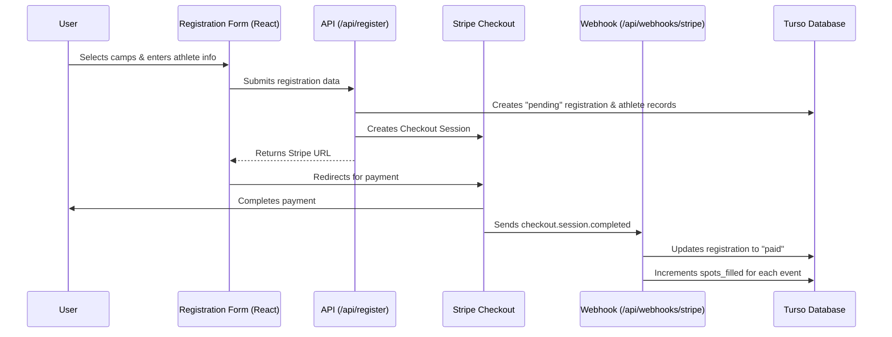

# Native Registration System

This project features a custom-built, native registration and payment system for TVVC summer camps and clinics. It replaces previous third-party solutions with a deeply integrated, high-performance architecture.

## 🏗️ Architecture Overview

The system is built on a modern serverless stack:

- **Frontend**: React-based multi-step registration form with real-time price calculation.
- **Backend API**: Astro API routes for registration processing and Stripe webhooks.
- **Database**: Turso (LibSQL) managed via Drizzle ORM for resilient, edge-compatible data storage.
- **Payments**: Stripe Checkout integration with automated capacity management via webhooks.

## 🗄️ Database Schema

The schema (defined in `src/db/schema.ts`) consists of four primary tables:

1.  **`events`**: Stores camp and clinic details (name, price, capacity, spots filled).
2.  **`registrations`**: Master record for each family's checkout session.
3.  **`athletes`**: Individual athlete profiles associated with a registration (includes medical info and waivers).
4.  **`registration_items`**: Junction table linking athletes to specific events.

## 🔄 Registration Flow



## 🔐 Administration

The system includes an authenticated, role-protected admin suite located at
`/admin`. Admin API mutations verify the current server-side session and the
user's current database role on every request.

### Features:
- **Event Manager**: View all camps/clinics, current capacity, and toggle active status.
- **Capacity Editor**: Real-time adjustment of maximum registration caps.
- **Roster Viewer**: Detailed lists of athletes signed up for specific events, including medical notes and contact info.
- **CSV Export**: Generate rosters for coaches and check-in desks.

## 🛠️ Maintenance & Operations

### Seeding Events
The database can be automatically populated or updated from the frontend HTML definitions:
```bash
npm run db:seed
```

### Refunds and Changes
Since this is a custom system, refunds and event changes are currently handled through the Stripe Dashboard. The webhook will not automatically decrement `spots_filled` on refund; this should be adjusted manually in the Admin Panel if necessary.

## 📄 Legal Agreements
Every registration requires agreement to:
1.  **Liability Waiver**: Full assumption of risk and release of liability.
2.  **Media Release**: Permission to use photos/videos for promotional purposes (Optional).

The system content content for these is sourced from `TVVC Waiver.txt` and integrated directly into the `RegistrationForm.tsx` component.

## 🛠️ Adding New Fields

When adding new information to a registration form (e.g., adding a "Division" or "Jersey Size" field), you **must** follow these steps to ensure data is saved correctly:

1.  **Update Schema**: Add the new column to the relevant table in `src/db/schema.ts`.
2.  **Sync Database**: Run `npm run db:push` to apply the change to the production Turso database.
3.  **Update API**: Update the insertion logic in `src/pages/api/register.ts` to include the new field in the `.values()` call.
4.  **Update Frontend**: Ensure the React form component (e.g., `TournamentRegistrationForm.tsx`) is sending the field in the POST request body.

**Warning**: If a field is added to the frontend but not the database schema, the insertion will either ignore the data or fail with a "no such column" error if the API tries to insert it.

## 🚀 Deployment & Environment

To run the system correctly, the following environment variables must be configured.

### 🔑 Required Variables

| Variable | Description | Source |
| :--- | :--- | :--- |
| `STRIPE_SECRET_KEY` | Stripe API Secret Key | Stripe Dashboard (Developers > API Keys) |
| `PUBLIC_STRIPE_PUBLISHABLE_KEY` | Stripe API Publishable Key | Stripe Dashboard (Developers > API Keys) |
| `STRIPE_WEBHOOK_SECRET` | Secret to verify webhook signatures | Stripe Dashboard (Webhooks > Endpoint Secret) |
| `TURSO_DATABASE_URL` | LibSQL Database connection URL | Turso Dashboard or `turso db show` |
| `TURSO_AUTH_TOKEN` | Turso Database access token | Turso Dashboard or `turso db tokens create` |
| `AUTH_SECRET` | Signs and verifies Auth.js sessions | Generate a long random secret |
| `CRON_SECRET` | Bearer token required by scheduled cleanup | Generate a separate long random secret |

Admin access is controlled by the authenticated user's `role` in the `user`
table. Browser-supplied passcodes are not accepted by admin APIs.

### 💻 Local Setup
1. Create a `.env` file from `.env.example`.
2. Use **Test Mode** keys from Stripe.
3. For webhooks, use the Stripe CLI: `stripe listen --forward-to localhost:4321/api/webhooks/stripe`.

### 🌐 Netlify Production
1. Add the variables above in **Site Configuration > Environment variables**.
2. **Crucial**: Use **Live Mode** keys for Stripe.
3. Set the Webhook URL in Stripe to: `https://your-domain.com/api/webhooks/stripe`.
4. Ensure the build command is `npm run build` and the publish directory is `dist`.
